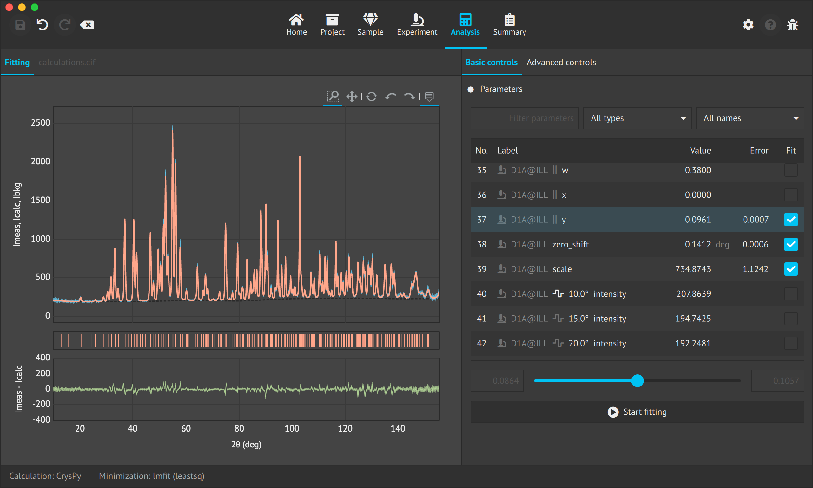

## [![CI Build][20]][21] [![Release][30]][31] [![Downloads][70]][71] [![Lines of code][82]][80] [![Total lines][81]][80] [![Files][83]][80] [![License][50]][51]

**easyDiffraction** is a scientific software for modelling and analysis of diffraction data. Currently, **easyDiffraction** covers classical 1D unpolarized neutron powder diffraction data collected using constant wavelength (CW) or time-of-flight (TOF) diffractometers.

## What is easydiffraction for?

**easyDiffraction** allows simulation of diffraction patterns based on a structural model and refinement of its parameters. For refinement, the program uses a number of fitting engines (minimizers) such as [lmfit](https://lmfit.github.io/lmfit-py), [bumps](https://github.com/bumps/bumps) and [DFO-LS](https://github.com/numericalalgorithmsgroup/dfols).

**easyDiffraction** is similar to crystallographic programs like FullProf, Jana, GSAS, ShelX, etc. Unlike these programs **easyDiffraction** is based on _external_ crystallographic libraries (calculation engines) such as [CrysPy](https://github.com/ikibalin/cryspy), [CrysFML](https://code.ill.fr/scientific-software/crysfml) and [GSAS-II](https://subversion.xray.aps.anl.gov/trac/pyGSAS). This allows **easyDiffraction** to cover different functionality aspects within a single, intuitive and user-friendly graphical interface. These libraries are included with the installation so there is no need to compile/install them separately.

## Main features

**easyDiffraction** is an open source project under the [BSD-3-Clause License](LICENSE.md). 

**easyDiffraction** application is cross-platform, with support for Windows, macOS and Linux (Ubuntu). Its intuitive tabbed interface allows for a clear and defined data modelling and analysis workflow. There are also built-in step-by-step user guides and tutorials for new users.

Current main features of **easydiffraction**:

- Support for both constant-wavelength and time-of-flight 1D unpolarized neutron powder diffraction data.
- Simulations of diffraction pattern using [CrysPy](https://github.com/ikibalin/cryspy), [CrysFML](https://code.ill.fr/scientific-software/crysfml) and [GSAS-II](https://subversion.xray.aps.anl.gov/trac/pyGSAS) calculation engines.
- Structure refinement (yet unstable) using aforementioned engines.
- Multiple minimization engines: [lmfit](https://lmfit.github.io/lmfit-py), [bumps](https://github.com/bumps/bumps) and [DFO-LS](https://github.com/numericalalgorithmsgroup/dfols).
- Parameter constraints during refinement.
- Crystal structure visualizer and builder.
- Diffraction pattern viewer, including Bragg peaks and residual curve.
- Live update of calculations on parameters change.
- Input files are in [CIF (Crystallographic Information File)](https://www.iucr.org/resources/cif) format.
- Interactive HTML and standard PDF report generation.
- Undo/redo for both parameter changes and fitting.

Planned improvements / new functionality for **easydiffraction**:

- Improved refinement.
- Time-of-flight support using [CrysFML](https://code.ill.fr/scientific-software/crysfml) and [GSAS-II](https://subversion.xray.aps.anl.gov/trac/pyGSAS).
- Asymmetric peak shapes.
- Multiple phases and datasets.
- Combined and sequential refinement.
- Support for polarized neutron data.
- Single crystal data.
- Magnetic structure refinement.
- Pair distribution function.
- X-ray data analysis.

## Getting Started

### Downloading

The official **easyDiffraction** installer for Windows, macOS and Linux (Ubuntu) can be found [here](https://github.com/easyScience/easyDiffractionApp/releases):

### Installing

Run **easyDiffraction** installer and follow the instructions.

### Uninstalling

Run **MaintenanceTool** from the **easydiffraction** installation directory, select _Remove all components_ and follow the instructions.

## Common Issues

- On `macOS`, if you see the message _easyDiffractionSetup.app can't be opened because it is from an unidentified developer_, do the following:
In the **Finder**, locate the **easydiffraction** installer application, then _control-click_ the installer icon, then choose _Open_ from the shortcut menu and finally click _Open_.
- On `Linux` based system there can be the following error on startup: _Failed to create OpenGL context for format QSurfaceFormat_. This is due to a system OpenGL driver problem. Please re-install your graphics card drivers.

## Common Issues

- On `macOS`, if you see the message _easyDiffractionSetup.app can't be opened because it is from an unidentified developer_, do the following:
In the **Finder**, locate the **easyDiffraction** installer application, then _control-click_ the installer icon, then choose _Open_ from the shortcut menu and finally click _Open_.
- On `Linux` based system there can be the following error on startup: _Failed to create OpenGL context for format QSurfaceFormat_. This is due to a system OpenGL driver problem. Please re-install your graphics card drivers.

## Contributing

We absolutely welcome contributions. **easyDiffraction** is maintained by the [European Spallation Source ERIC (ESS)](https://europeanspallationsource.se/) and on a volunteer basis and thus we need to foster a community that can support user questions and develop new features to make this software a useful tool for all users while encouraging every member of the community to share their ideas.

## Get in touch

For general questions or comments, please contact us at [support@easydiffraction.org](mailto:support@easydiffraction.org).

For bug reports and feature requests, please use [Issue Tracker](https://github.com/easyScience/easyDiffractionApp/issues) instead.

<!---URLs--->
<!---https://naereen.github.io/badges/--->

<!---CI Build Status--->

[20]: https://img.shields.io/github/workflow/status/easyScience/easyDiffractionApp/build%20macOS,%20Linux,%20Windows/master
[21]: https://github.com/easyScience/easyDiffractionApp/actions?query=workflow%3A%22build+macOS%2C+Linux%2C+Windows%22

<!---Release--->

[30]: https://img.shields.io/github/release/easyScience/easyDiffractionApp.svg?include_prereleases
[31]: https://github.com/easyScience/easyDiffractionApp/releases

<!---License--->

[50]: https://img.shields.io/github/license/easyScience/easyDiffractionApp.svg
[51]: https://github.com/easyScience/easyDiffractionApp/blob/master/LICENSE.md

<!---LicenseScan--->

[60]: https://app.fossa.com/api/projects/git%2Bgithub.com%2FeasyScience%2FeasyDiffractionApp.svg?type=shield
[61]: https://app.fossa.com/projects/git%2Bgithub.com%2FeasyScience%2FeasyDiffractionApp?ref=badge_shield

<!---Downloads--->

[70]: https://img.shields.io/github/downloads/easyScience/easyDiffractionApp/total.svg
[71]: https://github.com/easyScience/easyDiffractionApp/releases

<!---Code statistics--->

[80]: https://github.com/easyScience/easyDiffractionApp
[81]: https://tokei.rs/b1/github/easyScience/easyDiffractionApp
[82]: https://tokei.rs/b1/github/easyScience/easyDiffractionApp?category=code
[83]: https://tokei.rs/b1/github/easyScience/easyDiffractionApp?category=files

<!---W3C validation--->

[90]: https://img.shields.io/w3c-validation/default?targetUrl=https://easyscience.github.io/easyDiffractionApp
[91]: https://easyscience.github.io/easyDiffractionApp
